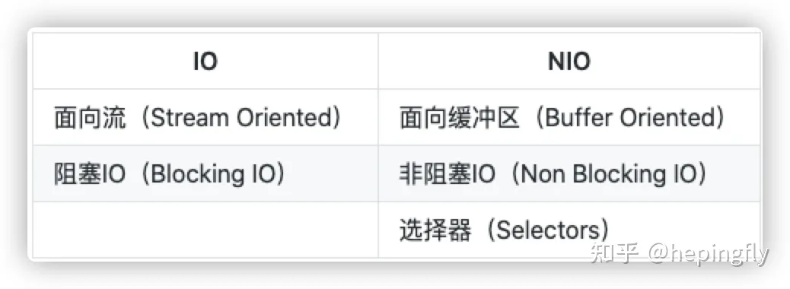
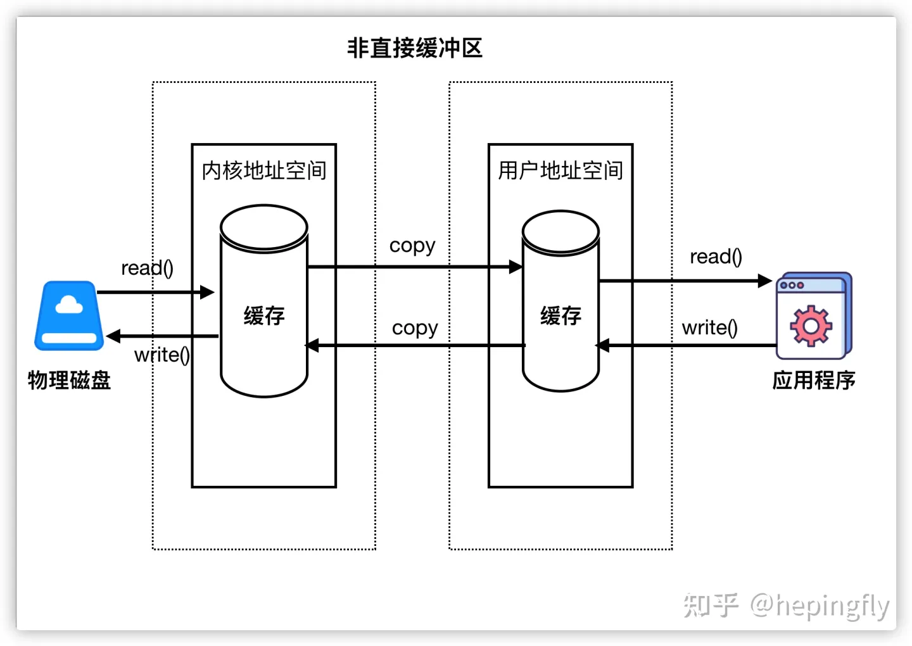
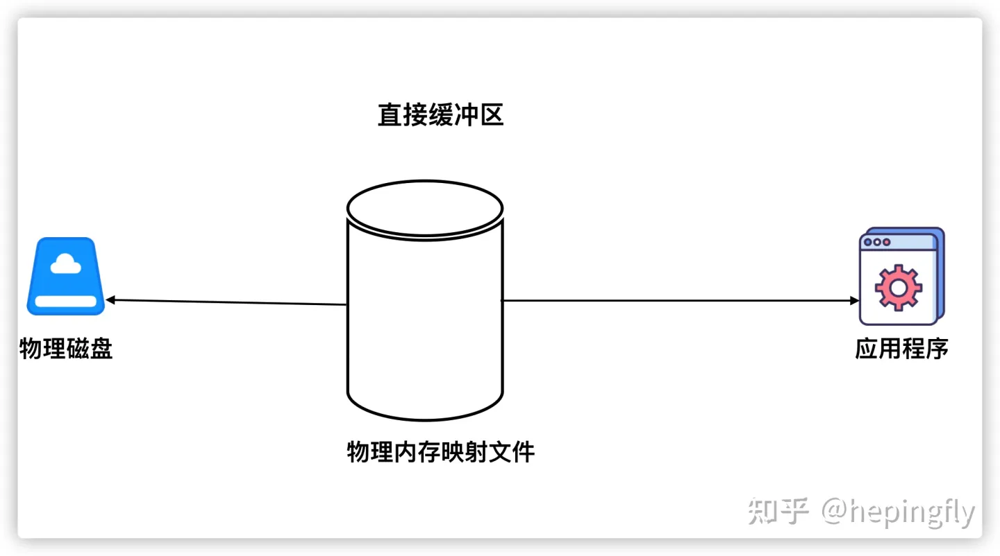
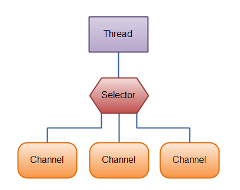
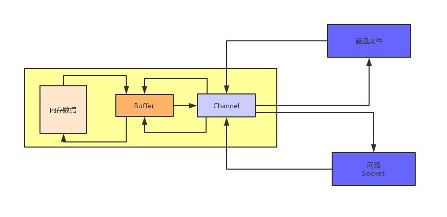

## NIO
### 1. 背景
从 JDK1.4 开始，Java提供给了一系列改进的输入/输出处理的新功能，这些功能被统称为新IO，新增了许多用于处理输入/输出的类，这些类都被
放在java.nio包以及子包下，并且对原java.io包中的许多类都以NIO为基础进行了改写，新增了满足NIO的功能。

### 2，概述
新IO和传统IO有相同的目的，都是用于输入/输出，但新IO使用了不同的方式来处理输入输出。
新IO采用内存映射文件的方式来处理，将文件或文件的一段区域映射到内存中，这样就可以像访问内存一样
来访问文件了，速度比传统的方式要快得多。

Channel(通道)和Buffer(缓冲区)是新IO的两个核心对象，Channel是对传统的输入输出系统的模拟，
在新IO中都通过通道传输。与传统的InputStream、OutputStream的最大区别在于它提供了一个map()方法，
通过该方法可以直接将“一块数据”映射到内存中。如果说传统的输入输出系统是面向流的处理，则新IO是面向块的处理。

Buffer可以理解为一个容器，本质是一个数组，发送到Channel中的所有对象都必须首先放到Buffer中，而从
Channel中读取的数据也必须先放到Buffer中。

除了Channel和Buffer之外，NIO还提供了用于将Unicode字符串映射成字节序列以及逆映射操作的Charset类，
也提供了用于支持非阻塞式输入输出的Selector类。

### 3. Buffer
除了布尔类型之外，其他的基本数据类型都有对应的Buffer类，如IntBuffer、ByteBuffer、CharBuffer...
allocate(int capacity); // 创建一个容量为capacity的xxxBuffer对象。
在Buffer中有三个重要的概念：容量(capacity)、界限(limit)和位置(position)。   
capacity: 缓冲区的容量表示该Buffer的最大数据容量，即最多可以存储多少数据。
limit: 第一个不应该被读出或写入的缓冲区的位置索引。也就是说，位于limit后的数据既不可被读，也不可以被写。
position: 用于指明下一个可以被读出或写入的缓冲区位置索引。

Buffer中包含两个重要的方法，即flip()和clear(),flip()为从Buffer中取出数据做好准备，
而clear()为再次向Buffer中装入数据做好准备。

除了一些移动position、limit、mark的方法之外，Buffer的所有子类还提供了两个重要方法: put()和get()
方法，用于向Buffer中放入数据和从Buffer中取出数据，在这个过程中，Buffer既支持对单个数据的访问，也支持对批量数据的访问。

当使用put()和get()来访问Buffer中的数据时，分为相对和绝对两种。
1.相对：从Buffer的当前position处开始读取或写入数据，然后将position的值按处理元素的个数增加。
2.绝对：直接根据索引向Buffer中读取或写入数据，使用绝对方式访问Buffer里的数据时，并不会影响position的值。

根据索引来取值的方式不会影响到Buffer的position
ByteBuffer还提供了一个allocateDirect()方法来创建直接Buffer，直接Buffer创建的成本比普通Buffer的成本高，但直接
Buffer的读取效率更高。
由于直接Buffer的创建成本高，所以直接Buffer只适用于长生存周期的Buffer，而不适用于短生命周期、一次用完就丢弃的Buffer。
只有ByteBuffer才提供了allocateDirect()方法。

### 4.Channel
Channel类似于传统的流对象，但有两个重要区别：
1. Channel可以直接将指定文件的部分或全部直接映射成Buffer。
2. 程序不能直接访问Channel中的数据，包括写入、读取都不行，Channel只能与Buffer进行交互。
也就是说，如果要从Channel中取得数据，必须先用Buffer从Channel中取出一些数据，然后让程序从Buffer中取得这些数据。
写入也是先将数据放入Buffer中，再将Buffer里的数据写入Channel。

### 文件锁
从JDK1.4的NIO开始，Java开始提供文件锁的支持。
在FileChannel中提供的lock()/tryLock()方法可以获得文件锁FileLock对象，从而锁定文件。
tryLock()：非阻塞式的加锁方法
文件锁虽然可以用于控制并发访问，但对于高并发访问的情形，还是推荐使用数据库来保存程序信息，而不是使用文件。

### Java7的NIO2
Java7对原有的NIO进行了重大改进，改进主要包括两方面的内容：
1.提供了全面的文件IO和文件系统访问支持
2.基于异步Channel的IO

Path、Paths和Files：
Path接口代表一个平台无关的平台路径。Files包含了大量静态的工具方法来操作文件，Paths则包含了两个返回Path的静态工厂方法。
Files：复制文件、判断是否为隐藏文件、文件的大小、将多个字符串内容写入指定文件中。

FileVisitor:遍历文件和目录
walkFileTree():遍历指定目录下的所有文件和子目录，也可以指定遍历的深度。
还支持访问目录之后或之前触发指定方法，

WatchService:用于监控文件变化，可以非常优雅地监控指定目录下文件的变化，至于文件发生变化后，程序应该进行哪些处理，这就取决于程序的业务需要了。

FileAttributeView接口的实现类：开发者可以为特定文件设置ACL及文件所有者的属性，可以获取或修改文件的基本属性，
包括文件的最后修改时间、最后访问时间、创建时间等；还可以让开发者为文件设置一些自定义属性。

另起：
### 1. 介绍
NIO(Non-blocking IO),是一种同步非阻塞的I/O模型，也是I/O多路复用的基础，已经被越来越多地应用到大型应用服务器
，成功解决高并发与大量连接、I/O处理问题的有效方式。
vs传统BIO:
以socket.read()为例子：
传统的BIO里面socket.read()，如果TCP RecvBuffer里没有数据，函数会一直阻塞，直到收到数据，返回读到的数据。
对于NIO，如果TCP RecvBuffer有数据，就把数据从网卡读到内存，并且返回给用户；反之则直接返回0，永远不会阻塞。
最新的AIO(Async I/O)里面会更进一步：不但等待就绪是非阻塞的，就连数据从网卡到内存的过程也是异步的。
换句话说，BIO里用户最关心“我要读”，NIO里用户最关心"我可以读了"，在AIO模型里用户更需要关注的是“读完了”。
NIO一个重要的特点是：socket主要的读、写、注册和接收函数，在等待就绪阶段都是非阻塞的，真正的I/O操作是同步阻塞的（消耗CPU但性能非常高）

### 如何结合事件模型使用NIO同步非阻塞特性
NIO的读写函数可以立刻返回，这就给了我们不开线程利用CPU的最好机会：如果一个连接不能读写，我们
就可以把这件事记下来，记录的方式通常在Selector上注册标记位，然后切换到其他就绪的连接(channel)继续进行读写。

利用事件模型单线程处理所有I/O请求：
NIO的主要事件有几个：读就绪、写就绪、有新连接到来。
NIO由原来的阻塞读写（占用线程）变成了单线程轮询事件，找到可以进行读写的网络描述符进行读写。
除了事件轮询事阻塞的，剩余的I/O操作都是纯CPU操作，没必要开启多线程。
由于线程的节约，连接数大的时候因为线程切换带来的问题也随之解决，进而为海量连接提供了可能。

### 通道和缓冲区
Channel负责传输，Buffer负责存储。
通道本身不能传输数据，要想传输数据必须要有缓冲区。这个缓冲区可以理解为火车，通道可以理解为铁路。
当要把程序中的数据写到文件中时，可以把数据都写到缓冲区，然后缓冲区通过通道进行传输，最后把数据从缓冲区中拿出来写到文件中。
这种传输数据的方式叫面向缓冲区，通道只负责连接，缓冲区负责存储数据。

### 直接缓冲区与非直接缓冲区
1. 非直接缓冲区
通过allocate()方法分配缓冲区，将缓冲区建立在JVM内存中。

应用程序和磁盘之间要想传输数据，是没有办法直接进行传输的。操作系统出于安全的考虑，会经过上图几个步骤。
如想从磁盘中读取一个数据，这时候应用程序向操作系统发起一个读请求，则首先磁盘中的数据会被读取到内核地址空间中，然后会把内核地址空间中的数据拷贝到
用户地址空间中，最后再把这个数据读取到应用程序中来。
2. 直接缓冲区
通过allocateDirect()方法分配缓冲区，将缓冲区建立在物理内存之中。

直接将物理内存作为缓冲区，读写数据直接通过物理内存进行。

### 通道
Channel本身不能直接访问数据，只能与Buffer进行交互。
实现类有：FileChannel\SocketChannel...

### Selector
引入Selector后，需要将之前创建的一个或多个可选择的Channel注册到Selector对象，一个键（SelectorKey）
将会被返回。SelectorKey会记住你关心的Channel，也会追踪对应的Channel是否已就绪。

为了使用Selector，我们首先需要将Channel注册到Selector中，随后调用Selector的select()方法，这个方法会阻塞，直到注册在Selector中的Channel
发送可读写事件，当这个方法返回后，当前的这个线程就可以处理Channel的事件了。
如果一个Channel要注册到Selector中，那么这个Channel必须是非阻塞的，因此FileChannel是不能够使用选择器的，因为FileChannel是阻塞的。

Selector允许单线程处理多个Channel，如果你的应用打开了多个连接（通道），但每个连接的流量都很低，使用Selector就会很方便。
### 相关面试题
1. BIO,NIO,AIO都有什么区别，NIO的原理是什么？
BIO：同步阻塞IO，在响应返回前，客户端那边就阻塞等待，缺点是：每次一个客户端接入，都需要在服务器创建一个线程来服务这个客户端，
当大量客户端来的时候，会造成服务端的线程数量可能达到几千甚至上万，可能会造成服务器端过载，最后崩溃。
传统的IO模型的网络服务的设计模式中有两种比较经典的：一个是多线程，一个是依靠线程池来进行处理。
2. NIO：同步非阻塞IO，基于Reactor模型来实现的。其实相当于就是一个线程处理大量的客户端的请求，通过一个线程轮询大量的channel，
每次获取一批有事件的channel，所有客户端请求都不会阻塞。
3. AIO，异步非阻塞IO，基于Proactor模型实现。每个连接发送过来的请求，都会绑定一个Buffer,然后通知操作系统去异步地读，这个
时间你就可以去做其他的事情，等到操作系统完成读之后，就会调用你的接口，给你操作系统读完的数据。这个时候你就可以拿到数据进行处理，
将数据往回写的过程，同样是给操作系统一个Buffer,然操作系统去完成，写完了再通知你。

同步就是自己主动去轮询操作系统，异步就是操作系统反过来通知你。

