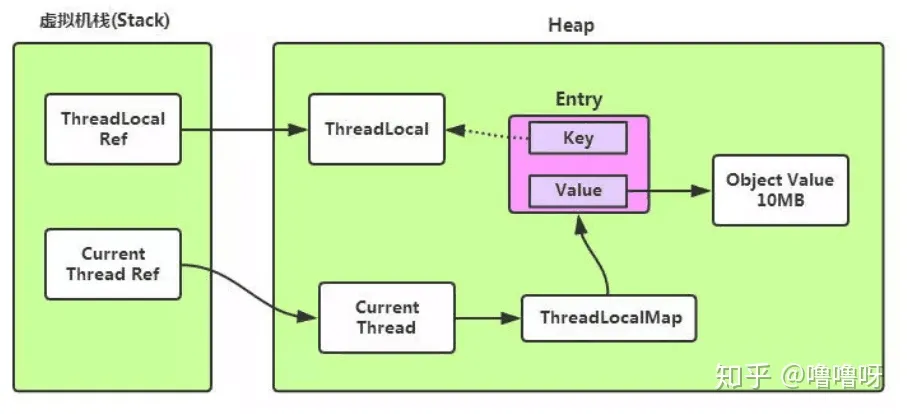

### 内部类的种类
成员内部类、静态内部类、局部内部类、匿名内部类。

### 内部类的优点
1. 实现多重继承
2. 内部类可以很好地实现隐藏
3. 减少了类文件编译后产生的字节码文件的大小

### 内部类的缺点
程序结构复杂

### 内部类的共性
1. 内部类在编译完成后也会产生.class文件，文件名为：外部类名$内部类名称.class
2. 内部类不能用普通的方式进行访问
3. 内部类声明为静态时，就不能随便地访问外部类的成员变量了，此时内部类只能访问外部类的静态成员变量
4. 外部类不能直接访问内部类的成员，但可以通过内部类对象来访问

### 内部类的定义格式
public class OuterClass {
    public class InnerClass{
        // 内部类的成员
    }
}

### 内部类的分类
1. 成员内部类
也叫实例内部类。应用场合: 每一个外部类对象都需要一个内部类的实例，内部类离不开外部类的存在。
特征：成员内部类可以直接访问外部类的成员，包括私有的，也可以通过外部类名.this.成员名调用外部成员。
外部类访问非静态内部类的成员，必须要创建成员内部类对象，外部类可以通过类名直接访问静态内部类的静态成员，包括私有的。
成员内部类中不能定义static变量和方法。
使用格式： Outer outer = new Outer(); Outer.Inner inner = outer.new Inner();
2. 静态内部类
内部类使用static声明。
使用场合：内部类不需要外部类的实例，静态内部类存在仅仅为外部类提供服务或者逻辑上属于外部类。
特征：静态内部类不会持有外部类的引用，静态内部类可以访问外部的静态变量，如果访问外部类的成员变量必须通过外部类的实例访问。
使用格式：Outer.Inner inner = new Outer.Inner();
3. 局部内部类
局部内部类是定义在一个方法中的内嵌类。
使用场合：如果内部类对象仅仅为外部类的某个方法使用，使用局部内部类。
特征：用在方法内部，作用范围仅限于该方法中。根据情况决定持有外部类对象引用。不能用private、protected、public修饰符。不能包含静态成员。
4. 匿名内部类
如果一个内部类在整个操作中只使用一次的话，就可以定义为匿名内部类。匿名内部类也就是没有名字的内部类，
这是java为了方便使用而设计的一个机制，因为有时候有的内部类只需要创建一个它的对象就可以了，以后不会再用到。
使用场合：简化内部类的使用。
特征：使用new创建，没有具体位置，创建的匿名类，默认继承或实现new后面的类型，内嵌匿名类编译后生成的
.class文件的命名方式是“外部类名称$编号.class”，编号为1，2，3...n，编号为x的文件对应的就是第x个匿名类。
格式：new 类名/接口/抽象类() {}

### ThreadLocal与内存泄漏
Thread中维护了ThreadLocalMap，所以ThreadLocalMap的生命周期和Thread一样长。使用不当可能会导致内存泄漏问题。
在ThreadLocal中，进行get和set操作的时候会清除Map中所有key为null的value。

ThreadLocal本身并不存储值，而是作为一个key来让线程从ThreadLocal中获取value。Entry中的key是弱引用，
所以jvm在垃圾回收时如果外部没有强引用来引用它，ThreadLocal必然会被回收。但是，作为ThreadLocalMap中的key，
ThreadLocal被回收后，ThreadLocalMap就会存在null，但value不为null的Entry。若当前线程一直不结束，可能是
作为线程池的一员，线程结束后不被销毁，或者分配(当前线程又创建了ThreadLocal对象)使用了又不再调用get/set方法，
就可能引发内存泄漏。其次，就算线程结束了，操作系统在回收线程时不是一定杀死线程或进程的，在繁忙的时候，只会清楚线程或进程
数据的操作，重复使用线程或进程。因此，key弱引用并不是导致内存泄漏的原因，而是因为ThreadLocalMap的生命周期与当前线程一样长，
并且没有手动删除对应value。

### 为什么要将Entry中的key设为弱引用？
设为弱引用的key能预防大多数内存泄漏的情况。如果key为强引用，引用的ThreadLocal的对象被回收了，但是ThreadLocalMap
中还持有ThreadLocal的强引用，如果没有手动删除，则ThreadLocal不会被回收，导致Entry内存泄漏。如果key为弱引用，
引用的ThreadLocal的对象被回收了，由于ThreadLocalMap中还持有ThreadLocal的弱引用，即使没有手动删除，ThreadLocal也会被GC回收。
value在下一次ThreadLocalMap调用get\set\remove的时候也会被清除。

### 如何避免弱引用引发的内存泄漏
在使用完ThreadLocal时，及时调用它的remove方法清除数据。

ThreadLocal的设计本身就是为了能够在当前线程中有属于自己的变量，并不是为了解决并发或共享变量的问题。

